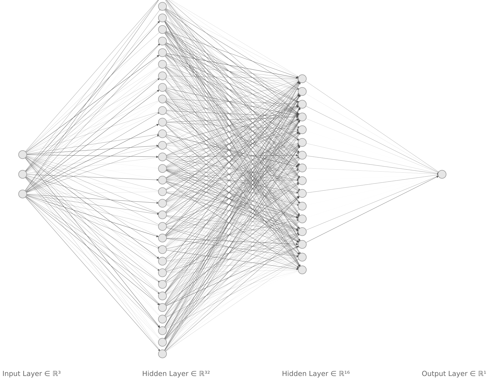

# [Machine Learning in Julia for Calorimeter Showers](https://hepsoftwarefoundation.org/gsoc/2024/proposal_JuliaHEPShowersML.html) - Evaluation Exercise

## Task
Use Julia and Flux.jl to train a binary classification model that learns to distinguish _signal_ and _background_ classes based on _x_, _y_ and _z_ coordinate parameters. Additionally, the code should be easily distributed by properly tracking the environment and its dependencies.

## Environment
Julia Version: Julia v1.10.2 (arm64-apple-darwin22.4.0)

The dependencies are tracked in _Project.toml_, and you can activate this environment interactively with _Pkg_ by typing `activate .` or using `--project` option when running Julia scripts. When using a notebooks, if you're using VS Code, it should already be activated by itself. The environment contains the following packages:

##### Base packages
These two packages are essential to the exercise:
- CSV v0.10.13 - For data parsing
- Flux v0.14.13 - For model definition and training

##### Additional packages
The following packages aren't strictly required for the exercise, but were added for extra functionalities:
- ArgParse v1.1.5 - CLI arguments parsing
- JLD2 v0.4.46 - Saving and loading model weights
- ProgressMeter v1.10.0 - Iteractively display information during training (loss, epoch, step and validation accuracy)


## Project structure
This repository contains a notebook, a Julia package and a script that uses the package for model training and evaluation.
- **Notebook**: The notebook provides a detailed step-by-step explanation of the code and compares results from multiple training runs. It also goes more in depth on model evaluation, showing the confusion matrix and additional metrics, such as F1-score, precision and recall.
- **Julia package _HSFJuliaMLGSoC.jl_**: Building on the findings and implementations from the notebook, this package contains the code needed to run the trainings and validate the results. This is meant to be easily integrated into scripts or other packages, whereas the notebook is meant for interactive usage. The package code can be found on _src/HSFJuliaMLGSoC.jl_.
- **Training/evaluation _main.jl_ script**: This is a script that uses the **HSFJuliaMLGSoC.jl** package to train and calculate accuracy. It's utility is both to provide an easy way to train the model or calculate accuracy given pre-trained weights, and also serves as an example usage of the package.


## Implementation

### Model architecture

The chosen model architecture for this task was the Multi-Layer Perceptron (MLP). It's a proven choice for classification tasks with tabular data due to being both high-performant and easy to implement. On the notebook, multiple variations were tested until reasonable accuracy was achieved. This was so that the specific network wasn't arbritarely large, the tests iteratively increased the number of trainable parameters until satisfactory accuracy was achieved.

All of the variations had similarities in the input and output layers. The nodes of the input layer all had three weights, that correspond to the dimensionality of the data, i.e., the x,y,z coordinates. The output layer is composed of only one node, that outputs a single value in the [0,1] range (thanks to _sigmoid_ activation). This is because _signal_ is encoded as `true` (or `1`) and _background_ is encoded as `false` (or `0`). By setting a threshold at 0.5, if the output of the network is bigger than 0.5 it's interpreted as a _signal_ prediction, otherwise a _background_ prediction.

The first attempt had no hidden layers, which learned to always classify every input as _background_, due to dataset imbalance (77.555% of the data is composed of _background_ samples, so that results in 77.555% accuracy). Then a hidden layer was added, first with 8 nodes and then with 16, which reached 83.562% and 94.833% accuracy, respectively. Finally, another hidden layer was added, resulting in the final architecture represented by the image below. It has 2 hidden layers, the first with 32 nodes and the second with 16 nodes. Unlike the previous networks, which were trained and evaluated exclusively with Float64 precision on input data and weights/biases, Float32 was also tested for this final case. The use of Float64 was necessary to retain exact representation of the dataset predictors. In terms of accuracy, the values of 99.073% and 98.927% were achieved for Float64 and Float32 respectively. In terms of training time, step execution time was reduced by 7.5%, from 94.64μs to 87.51μs. Model size was also reduced from 5.63KiB to 3KiB.


*Final MLP Architecture*

### Loss function
There are actually two equivalent possibilities for the loss function:

- **crossentropy**: Loss function used to measure the difference between two probability distributions (the predicted and the ground-truth) over $C$ classes. For this, you also need to perform one-hot enconding of the labels and use _softmax_ function on the output layer, which must have $C$ nodes.

- **binarycrossentropy**: Particular case of crossentropy when for $C=2$. In this case, the labels are enconded in binary values and the output layer needs to use _sigmoid_ activation.
 
The chosen loss function was _binarycrossentropy_, but again, both approaches are equivalent. But this means that the network instead of outputting the probabilities of both classes, which are complementary, it only outputs one value, that also can be interpreted as the probability of the positive class (in this case _signal_).


### Training

The two main concepts needed to understand the training process are the concepts of step and epoch:

##### Step
The DataLoader yields a batch of data that is passed as input to the model, which outputs predictions in range [0,1], thanks to the sigmoid activation on the output dense layer. Again, 0 represents `background` and 1 represents `signal`. Based on those predictions, the loss function `binarycrossentropy` is used to calculate a scalar value that tells us how far away those predictions are from the ground-truth labels. Finally, that loss value is used to calculate the gradients and the _Adam_ optimiser, a method of gradient descent, slighty nudges the weights into the direction of decreasing the loss. This is the essence of the learning process.

##### Epoch
One epoch is a pass over all the batches that make the dataset, on which each sample is seen once. At the end of each epoch, the accuracy is calculated over the validation dataset. Checkpoints of the model are created every 50 epochs, even though the training is very quick. The vector that accumulates loss values to be displayed with ProgressMeter are also reset at the end of every epoch.

In summary, each step is a forward and backward pass through the neural network using a single batch of data, followed by a weights update using an optimization algorithm like Adam. An epoch represents one complete pass through the entire dataset, consisting of multiple steps, and the number of epochs chosen corresponds to how much the network is meant to be trained.


### Results
The final model has the following architecture, with a total of 673 trainable parameters:

```julia
using Flux

Chain(
  Dense(3 => 32, relu),                 # 128 parameters
  Dense(32 => 16, relu),                # 528 parameters
  Dense(16 => 1, σ)                     # 17 parameters
)
```

When trained over 200 epochs and evaluated over the whole dataset, the following metrics were achieved:

#### Confusion matrix

|              | ŷ _signal_ | ŷ _background_ |
|--------------|------------|----------------|
| y signal     |      22083 |            711 |
| y background |        362 |          76844 |


#### Scalar metrics

| Metric              | Value   |
|---------------------|--------:|
| Accuracy            | 98.927% |
| Precision           | 96.881% |
| Recall              | 98.387% |
| F1-score            | 97.628% |
| True Negative Rate  | 99.083% |
| False Positive Rate |  0.917% |


## Usage
You can either run the cells on the notebook to get new results, or use **main.jl** to train/eval via the CLI. Like previously stated, this script makes use of the definitions on _HSFJuliaMLGSoC.jl_. For the latter, you can run it with `--help` option to know more about the usage and arguments, but it can be used in two ways:

### Training from stratch
If you just provide the CSV dataset path, it will train the model and then calculate accuracy over the full dataset. You can also change the number of epochs with the option `--epochs`/`-e` (defaults to 200).

```zsh
danielregado@Daniels-MBP HSFJuliaMLGSoC % julia --project main.jl dataset.csv
Progress: 100%|█████████████████████████████████████████████████████████████████████████████████| Time: 0:00:30 ( 0.11 ms/it)
  epoch:    200
  step:     1329
  loss:     0.030916968
  val_acc:  0.9866
0.98728
```

### Using pre-trained weights
On top of passing the CSV dataset path, you can also provide a path to a JLD2 weights file to skip the training, with the `--modelweights`/`-w` option. In this case, the weights are loaded into the model, immediately followed by accuracy calculation. You can use the provided _mlp_2hidden_f32.jld2_ file to validate my results from the notebook execution.

```zsh
danielregado@Daniels-MBP HSFJuliaMLGSoC % julia --project main.jl dataset.csv -w mlp_2hidden_f32.jld2
0.98927
```